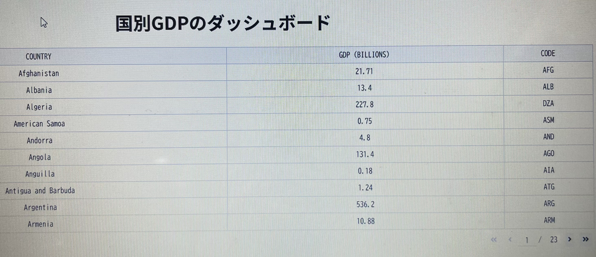
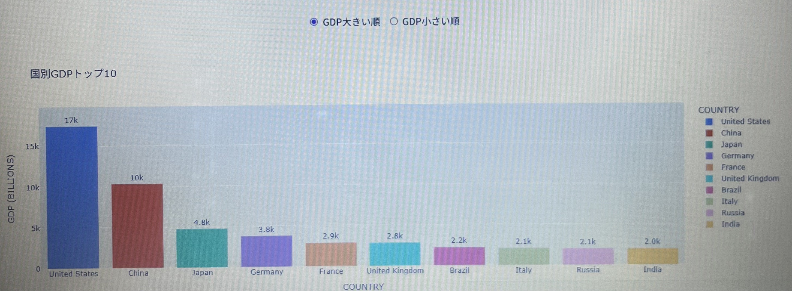

# 国別GDPダッシュボード



## 概要
Pythonの **Dash** と **Plotly** を使用して作成した **国別GDPを可視化するダッシュボードアプリ**です。

このアプリでは、世界各国のGDPデータをテーブルとグラフで表示し、GDPの大きい順・小さい順に並び替えて確認することができます。

## 主な機能
- 世界各国のGDPデータを **テーブル形式で表示**
- **GDPランキングのグラフ表示**
- **GDPの大きい順 / 小さい順の切り替え**
- インタラクティブなWebダッシュボード

## 使用技術
- Python
- Dash
- Plotly
- Pandas

## データソース

このアプリでは以下の公開データセットを使用しています。
https://github.com/plotly/datasets

## 実行方法
### 1. 必要なライブラリをインストール

```bash
pip install dash pandas plotly